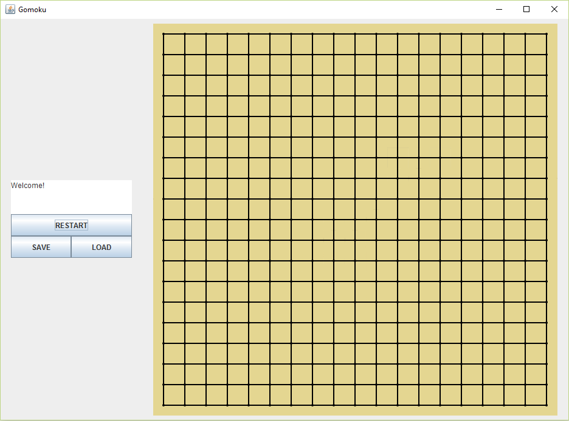
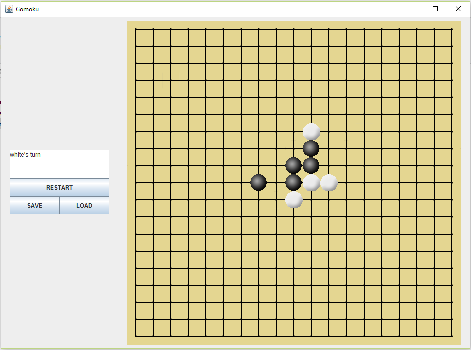
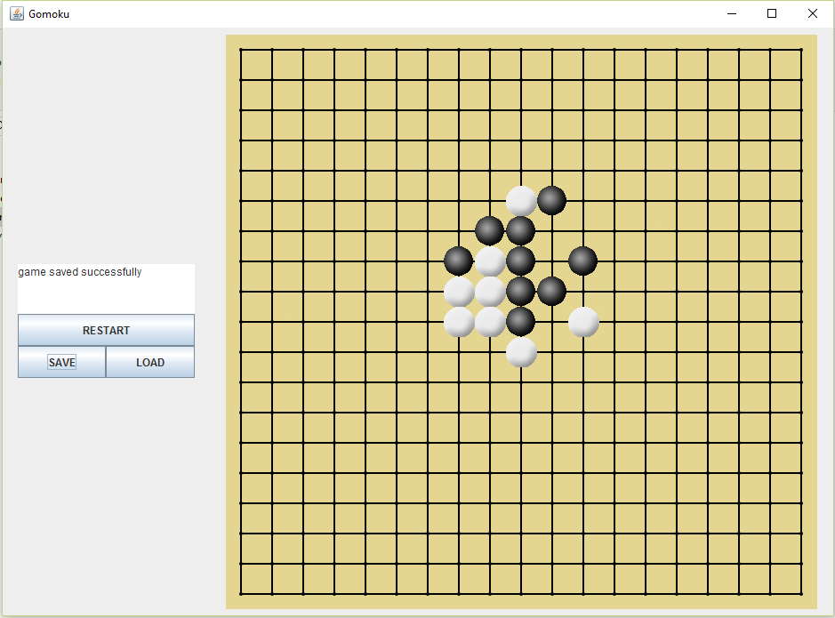

# Gomoku
Gomoku game or also known as Five in a Row (see reference: https://en.wikipedia.org/wiki/Gomoku). Written fully in Java

## Start
This game needs JRE 1.7 (Preferable java 1.8) to run.
Start by double click the gomoku.jar file or typing
```
java -jar gomoku.jar
```
in windows cmd or terminal


## Play
Play the game by clicking the board. White turn first




## Save
To save a game, click the save button. The app will create a file called save1.gomoku, and please don't move or modify the file



## Load
To load a game, click the load button. The current game will be abandoned. Make sure you have saved games before load it (make sure the file save1.gomoku exists in the same directory), if not it will just restart the game.


## Win
The game will stop when one of the player succeeds in putting the button a five in a row whether vertically, horizontally or diagonally.


## Enjoy :)
If you have something in mind about this game, please contact me to rezaqorib96[at]gmail[dot]com.